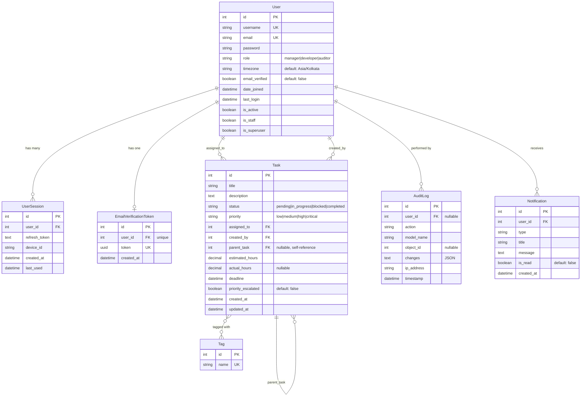

# Database Schema

## Entity Relationship Diagram



## Model Descriptions

### User
**Purpose**: Core user model with role-based access control

**Key Fields**:
- `role`: Determines permissions (manager, developer, auditor)
- `timezone`: User's timezone for time-based restrictions
- `email_verified`: Email verification status

**Relationships**:
- One-to-Many: UserSession, Task (as assigned_to), Task (as created_by), AuditLog, Notification
- One-to-One: EmailVerificationToken

---

### UserSession
**Purpose**: Track active user sessions for multi-device support

**Key Fields**:
- `refresh_token`: JWT refresh token (blacklisted on logout)
- `device_id`: Unique device identifier
- `last_used`: Auto-updated on token use

**Business Rules**:
- Maximum 3 sessions per user
- Oldest session deleted when limit exceeded

---

### EmailVerificationToken
**Purpose**: Email verification during registration

**Key Fields**:
- `token`: UUID for verification link
- One-to-one relationship with User

**Lifecycle**:
- Created on user registration
- Deleted after successful verification

---

### Task
**Purpose**: Core task management entity

**Key Fields**:
- `status`: Workflow state (pending → in_progress → blocked/completed)
- `priority`: Task priority (low, medium, high, critical)
- `assigned_to`: User responsible for task
- `created_by`: User who created task
- `parent_task`: Self-referencing for task hierarchy
- `priority_escalated`: Auto-escalated by middleware if overdue

**Relationships**:
- Many-to-One: User (assigned_to), User (created_by), Task (parent_task)
- One-to-Many: Task (child_tasks)
- Many-to-Many: Tag

**Indexes**:
- Composite index on (deadline, priority_escalated, status) for performance

---

### Tag
**Purpose**: Categorize tasks

**Examples**: "backend", "urgent", "bug", "frontend"

**Relationships**:
- Many-to-Many: Task

---

### AuditLog
**Purpose**: Compliance and audit trail

**Key Fields**:
- `action`: CREATE, UPDATE, DELETE
- `model_name`: Model that was changed
- `changes`: JSON field with before/after values
- `ip_address`: Request IP

**Captured By**: AuditLoggingMiddleware

---

### Notification
**Purpose**: User notifications (email, in-app)

**Key Fields**:
- `type`: Notification category
- `is_read`: Read status
- `message`: Notification content

---

## Database Constraints

### Primary Keys
- All tables use auto-incrementing integer primary keys

### Unique Constraints
- `User.username`
- `User.email`
- `Tag.name`
- `EmailVerificationToken.token`

### Foreign Key Constraints
- **ON DELETE CASCADE**: UserSession, EmailVerificationToken, Task (assigned_to, created_by, parent_task)
- **ON DELETE SET NULL**: AuditLog.user_id (preserve audit trail)

### Indexes
- `Task`: Composite index on (deadline, priority_escalated, status)
- Foreign keys automatically indexed by Django

---

## Data Flow Examples

### User Registration Flow
```
1. User created (email_verified=false)
2. EmailVerificationToken created automatically (via signal)
3. User verifies email
4. email_verified set to true
5. EmailVerificationToken deleted
```

### Task Assignment Flow
```
1. Manager creates Task (created_by=manager_id)
2. Task assigned to Developer (assigned_to=developer_id)
3. Developer updates status: pending → in_progress
4. Developer completes task: in_progress → completed
5. All changes logged in AuditLog
```

### Session Management Flow
```
1. User logs in
2. UserSession created with refresh_token and device_id
3. If user has >3 sessions, oldest is deleted
4. On logout, session deleted and token blacklisted
```

---

## Performance Considerations

**Optimized Queries**:
- Task queries use `select_related()` for assigned_to, created_by, parent_task
- Task queries use `prefetch_related()` for child_tasks, tags

**Indexes**:
- Composite index on Task(deadline, priority_escalated, status) for dashboard queries
- Automatic indexes on all foreign keys

**Caching Opportunities**:
- User profile (rarely changes)
- Tag list (static data)
- Analytics dashboard (cache for 5 minutes)

---

**Last Updated**: 2026-01-11  
**Database**: SQLite (development) / PostgreSQL (production)
