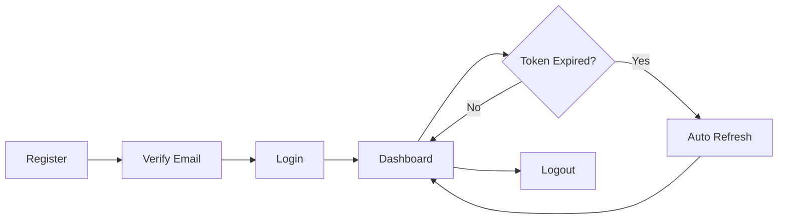

# CTMS Frontend Documentation

## Overview
Complete documentation for the Clinical Trial Management System (CTMS) React frontend application.

**Framework**: React 18 + TypeScript + Vite  
**Styling**: Tailwind CSS + shadcn/ui components  
**State Management**: React Context API  
**Routing**: React Router v6  
**HTTP Client**: Axios with interceptors

---

## Table of Contents
1. [Architecture](#1-architecture)
2. [Project Structure](#2-project-structure)
3. [Authentication System](#3-authentication-system)
4. [Components](#4-components)
5. [State Management](#5-state-management)
6. [API Integration](#6-api-integration)
7. [Routing & Navigation](#7-routing--navigation)
8. [Features](#8-features)
9. [Development Guide](#9-development-guide)

---

## 1. Architecture

### 1.1. Technology Stack

| Layer | Technology | Purpose |
|-------|------------|---------|
| Build Tool | Vite | Fast development server, optimized builds |
| Framework | React 18 | UI library with hooks |
| Language | TypeScript | Type safety and better DX |
| Styling | Tailwind CSS | Utility-first CSS framework |
| Components | shadcn/ui | Accessible, customizable components |
| State | Context API | Global state management |
| Routing | React Router v6 | Client-side routing |
| HTTP | Axios | API requests with interceptors |
| Forms | Native React | Controlled components |
| Icons | Lucide React | Icon library |
| DnD | @dnd-kit | Drag-and-drop for Kanban |
| Graphs | ReactFlow | Task dependency visualization |
| Dates | date-fns | Date manipulation and formatting |

### 1.2. Design Patterns

**Component Patterns**:
- Functional components with hooks
- Compound components (Card, CardHeader, CardContent)
- Higher-order components (ProtectedRoute)
- Context providers for global state

**State Management**:
- Context API for authentication
- Local state (useState) for component-specific data
- Optimistic UI updates with rollback

**API Integration**:
- Centralized Axios instance with interceptors
- Automatic token refresh
- Cookie-based refresh tokens
- Request/response transformations

---

## 2. Project Structure

```
frontend/
├── src/
│   ├── api/                    # API service layer
│   │   ├── auth.ts            # Authentication endpoints
│   │   └── tasks.ts           # Task endpoints
│   ├── components/            # Reusable components
│   │   ├── ui/                # shadcn/ui components
│   │   │   ├── button.tsx
│   │   │   ├── card.tsx
│   │   │   ├── input.tsx
│   │   │   ├── label.tsx
│   │   │   └── modal.tsx
│   │   ├── DependencyGraph.tsx  # Task dependency graph
│   │   ├── KanbanBoard.tsx      # Drag-and-drop board
│   │   ├── Layout.tsx           # App layout with sidebar
│   │   ├── ProtectedRoute.tsx   # Auth guard
│   │   └── TaskBadge.tsx        # Priority badge component
│   ├── context/               # React Context providers
│   │   └── AuthContext.tsx    # Authentication state
│   ├── lib/                   # Utilities
│   │   ├── axios.ts           # Axios instance + interceptors
│   │   └── utils.ts           # Helper functions (cn, etc.)
│   ├── pages/                 # Page components
│   │   ├── Tasks/
│   │   │   ├── TaskForm.tsx   # Create/Edit task
│   │   │   └── TasksList.tsx  # Task list view
│   │   ├── Dashboard.tsx      # Main dashboard
│   │   ├── Login.tsx          # Login page
│   │   ├── Register.tsx       # Registration page
│   │   └── VerifyEmail.tsx    # Email verification
│   ├── types/                 # TypeScript definitions
│   │   └── index.ts           # Shared types
│   ├── App.tsx                # Root component with routes
│   ├── main.tsx               # Entry point
│   └── index.css              # Global styles
├── public/                    # Static assets
├── vite.config.ts            # Vite configuration
├── tailwind.config.js        # Tailwind configuration
├── tsconfig.json             # TypeScript configuration
└── package.json              # Dependencies
```

---

## 3. Authentication System

### 3.1. Auth Flow



### 3.2. AuthContext

**Location**: `src/context/AuthContext.tsx`

**State**:
```typescript
{
  user: User | null;
  isLoading: boolean;
  isAuthenticated: boolean;
}
```

**Methods**:
```typescript
{
  login: (credentials) => Promise<void>;
  register: (data) => Promise<any>;
  logout: () => Promise<void>;
}
```

**Usage**:
```typescript
import { useAuth } from '../context/AuthContext';

function MyComponent() {
  const { user, isAuthenticated, logout } = useAuth();
  
  if (!isAuthenticated) {
    return <div>Please login</div>;
  }
  
  return <div>Welcome, {user.username}!</div>;
}
```

### 3.3. Token Management

**Access Token**:
- Stored in `localStorage` as `access_token`
- Attached to requests via Axios interceptor
- Short-lived (typically 15-30 minutes)

**Refresh Token**:
- Stored in HTTP-only cookie (secure, not accessible to JS)
- Automatically sent with requests via `withCredentials: true`
- Used to obtain new access tokens

**Auto-Refresh Flow**:
1. API request fails with 401
2. Axios interceptor catches error
3. Calls `/auth/refresh/` with cookie
4. Receives new access token
5. Retries original request
6. Queues concurrent failed requests

---

## 4. Components

### 4.1. Layout Components

#### Layout
**Location**: `src/components/Layout.tsx`

**Purpose**: Main application layout with sidebar navigation

**Features**:
- Sidebar with navigation links
- User profile display (username + role)
- Logout button
- Responsive design (mobile-friendly)

**Usage**:
```tsx
<Layout>
  <Outlet /> {/* Nested routes render here */}
</Layout>
```

#### ProtectedRoute
**Location**: `src/components/ProtectedRoute.tsx`

**Purpose**: Guard routes that require authentication

**Features**:
- Checks authentication status
- Redirects to login if not authenticated
- Shows loading state during auth check

**Usage**:
```tsx
<Route element={<ProtectedRoute />}>
  <Route path="/dashboard" element={<Dashboard />} />
</Route>
```

### 4.2. Feature Components

#### KanbanBoard
**Location**: `src/components/KanbanBoard.tsx`

**Purpose**: Drag-and-drop task board

**Features**:
- 4 columns: Pending, In Progress, Blocked, Completed
- Drag-and-drop to change status
- Optimistic UI updates with rollback
- Time restriction modal for developers (9 AM - 6 PM)
- Real-time priority badges

**Props**: None (uses global auth context)

**State**:
```typescript
{
  tasks: Task[];
  activeTask: Task | null;
  showWarning: boolean;
}
```

**Key Functions**:
- `loadMyTasks()`: Fetch tasks from API
- `handleDragStart()`: Track dragged task
- `handleDragEnd()`: Update task status (with time check)

#### DependencyGraph
**Location**: `src/components/DependencyGraph.tsx`

**Purpose**: Visualize task dependencies

**Features**:
- Tree layout showing parent-child relationships
- Interactive zoom/pan controls
- Auto-positioning algorithm
- ReactFlow-based rendering

**Algorithm**:
1. Calculate task levels (depth from root)
2. Group tasks by level
3. Position nodes in grid layout
4. Draw edges between parent-child

#### TaskBadge
**Location**: `src/components/TaskBadge.tsx`

**Purpose**: Display task priority with deadline warnings

**Props**:
```typescript
{
  priority: TaskPriority;
  deadline?: string | null;
  className?: string;
}
```

**Features**:
- Color-coded by priority (low=gray, medium=blue, high=orange, critical=red)
- Pulsing animation if deadline within 24 hours
- Warning emoji (⚠️) for urgent tasks

### 4.3. Page Components

#### Dashboard
**Location**: `src/pages/Dashboard.tsx`

**Features**:
- Analytics cards (My Tasks, Team Tasks, Efficiency Score)
- Kanban board
- Dependency graph

**Data Flow**:
```
Dashboard
  ├─> tasksApi.getAnalytics() → Analytics cards
  ├─> KanbanBoard → tasksApi.getTasks()
  └─> DependencyGraph → tasksApi.getTasks()
```

#### TasksList
**Location**: `src/pages/Tasks/TasksList.tsx`

**Features**:
- Card-based task list
- Create button (with time restrictions for developers)
- Delete button with confirmation (RBAC-based)
- Clickable cards for details/edit
- Status and priority badges

**RBAC Logic**:
```typescript
// Create button visibility
canCreateTask = user.role !== 'auditor' && 
                (user.role === 'manager' || isWithinWorkingHours())

// Delete button visibility
showDelete = user.role !== 'auditor'
```

#### TaskForm
**Location**: `src/pages/Tasks/TaskForm.tsx`

**Features**:
- Create/Edit task form
- All task fields (title, description, status, priority, etc.)
- RBAC-based field restrictions
- Read-only mode for auditors
- Dropdown for assigned users (managers only)
- Parent task selection

**Form Fields**:
- Title (required)
- Description
- Status (dropdown)
- Priority (dropdown)
- Estimated Hours (number)
- Actual Hours (number, optional)
- Deadline (datetime-local)
- Assigned To (dropdown, RBAC-controlled)
- Parent Task (dropdown, optional)
- Priority Escalated (checkbox)

**RBAC Behavior**:
```typescript
// Auditor: Read-only mode
if (user.role === 'auditor') {
  - All inputs disabled
  - Title: "Task Details" (not "Edit Task")
  - No Save button
  - Cancel → "Back"
}

// Developer: Limited assignment
if (user.role === 'developer') {
  - Can only assign to self
  - Assigned To dropdown disabled
}

// Manager: Full access
if (user.role === 'manager') {
  - Can assign to any user
  - All fields editable
}
```

---

## 5. State Management

### 5.1. Global State (Context)

**AuthContext**:
- User profile
- Authentication status
- Login/logout methods

**Why Context?**:
- Simple, built-in solution
- Sufficient for current app size
- No external dependencies

### 5.2. Local State (useState)

**Component-specific state**:
- Form data
- Loading states
- Error messages
- UI toggles (modals, dropdowns)

**Example**:
```typescript
const [tasks, setTasks] = useState<Task[]>([]);
const [loading, setLoading] = useState(true);
const [error, setError] = useState('');
```

### 5.3. Optimistic UI Pattern

**Implementation**:
```typescript
// 1. Update UI immediately
setTasks(prev => prev.map(t => 
  t.id === taskId ? { ...t, status: newStatus } : t
));

// 2. Call API
try {
  await tasksApi.updateTask(taskId, { status: newStatus });
} catch (error) {
  // 3. Rollback on error
  setTasks(prev => prev.map(t => 
    t.id === taskId ? { ...t, status: oldStatus } : t
  ));
  alert('Failed to update task');
}
```

**Benefits**:
- Instant feedback
- Better UX
- Graceful error handling

---

## 6. API Integration

### 6.1. Axios Configuration

**Location**: `src/lib/axios.ts`

**Features**:
- Base URL: `/api` (proxied to backend)
- `withCredentials: true` (send cookies)
- Request interceptor (attach access token)
- Response interceptor (auto-refresh on 401)

**Configuration**:
```typescript
const api = axios.create({
  baseURL: '/api',
  headers: { 'Content-Type': 'application/json' },
  withCredentials: true,  // CRITICAL for cookies
});
```

### 6.2. Request Interceptor

**Purpose**: Attach access token to all requests

```typescript
api.interceptors.request.use((config) => {
  const token = localStorage.getItem('access_token');
  if (token) {
    config.headers.Authorization = `Bearer ${token}`;
  }
  return config;
});
```

### 6.3. Response Interceptor

**Purpose**: Auto-refresh tokens on 401 errors

**Flow**:
1. Request fails with 401
2. Check if already refreshing
3. If yes: Queue request
4. If no: Call refresh endpoint
5. Update access token
6. Retry original request
7. Process queued requests

**Key Variables**:
- `isRefreshing`: Prevent concurrent refresh calls
- `failedQueue`: Store failed requests during refresh

### 6.4. API Services

#### authApi
**Location**: `src/api/auth.ts`

**Methods**:
```typescript
{
  register(data): Promise<User>;
  verifyEmail(token): Promise<void>;
  login(credentials): Promise<AuthResponse>;
  logout(): Promise<void>;
  getCurrentUser(): Promise<User>;
}
```

#### tasksApi
**Location**: `src/api/tasks.ts`

**Methods**:
```typescript
{
  getTasks(): Promise<Task[]>;
  getTask(id): Promise<Task>;
  createTask(data): Promise<Task>;
  updateTask(id, data): Promise<Task>;
  deleteTask(id): Promise<void>;
  bulkUpdateStatus(taskIds, status): Promise<void>;
  getAnalytics(): Promise<AnalyticsData>;
  getUsers(): Promise<User[]>;
}
```

---

## 7. Routing & Navigation

### 7.1. Route Structure

```
/
├── /login (public)
├── /register (public)
├── /verify-email (public)
└── / (protected)
    ├── / → Dashboard
    ├── /tasks → TasksList
    ├── /tasks/new → TaskForm (create)
    └── /tasks/:id → TaskForm (edit/view)
```

### 7.2. Route Configuration

**Location**: `src/App.tsx`

```tsx
<Routes>
  {/* Public routes */}
  <Route path="/login" element={<LoginPage />} />
  <Route path="/register" element={<RegisterPage />} />
  <Route path="/verify-email" element={<VerifyEmailPage />} />
  
  {/* Protected routes */}
  <Route element={<ProtectedRoute />}>
    <Route element={<Layout />}>
      <Route path="/" element={<Dashboard />} />
      <Route path="/tasks" element={<TasksList />} />
      <Route path="/tasks/new" element={<TaskForm />} />
      <Route path="/tasks/:id" element={<TaskForm />} />
    </Route>
  </Route>
  
  {/* Catch-all redirect */}
  <Route path="*" element={<Navigate to="/" replace />} />
</Routes>
```

### 7.3. Navigation Patterns

**Programmatic Navigation**:
```typescript
import { useNavigate } from 'react-router-dom';

const navigate = useNavigate();
navigate('/tasks');  // Go to tasks
navigate(-1);        // Go back
```

**Link Navigation**:
```tsx
import { Link } from 'react-router-dom';

<Link to="/tasks/new">Create Task</Link>
```

**Conditional Navigation**:
```typescript
// Redirect after login
await login(credentials);
navigate('/');

// Redirect if not authenticated
if (!isAuthenticated) {
  return <Navigate to="/login" replace />;
}
```

---

## 8. Features

### 8.1. Authentication Features

✅ **Registration with Email Verification**
- User registers with username, email, password
- Receives verification token
- Must verify email before login

✅ **Secure Login**
- JWT access tokens (short-lived)
- HTTP-only refresh tokens (secure)
- Automatic token refresh
- Session management (max 3 devices)

✅ **Session Persistence**
- Tokens validated on app load
- User stays logged in across refreshes
- Automatic logout on token expiration

### 8.2. Task Management Features

✅ **CRUD Operations**
- Create, Read, Update, Delete tasks
- Bulk status updates
- Task hierarchy (parent-child)

✅ **Role-Based Access Control**
- Managers: Full access
- Developers: Limited to assigned tasks
- Auditors: Read-only access

✅ **Time-Based Restrictions**
- Developers can only create/update during 9 AM - 6 PM
- Exception: Critical priority tasks
- Warning modal for restricted operations

✅ **Advanced UI**
- Drag-and-drop Kanban board
- Dependency graph visualization
- Real-time priority badges
- Optimistic UI updates

### 8.3. Dashboard Features

✅ **Analytics**
- My Tasks summary
- Team Tasks summary
- Efficiency score

✅ **Kanban Board**
- Visual task management
- Drag-and-drop status changes
- Filtered by user access

✅ **Dependency Graph**
- Parent-child task relationships
- Interactive visualization
- Auto-layout algorithm

---

## 9. Development Guide

### 9.1. Setup

```bash
# Install dependencies
npm install

# Start dev server
npm run dev

# Build for production
npm run build

# Preview production build
npm run preview
```

### 9.2. Environment Variables

**Vite Proxy** (configured in `vite.config.ts`):
```typescript
server: {
  proxy: {
    '/api': {
      target: 'http://localhost:8000',
      changeOrigin: true,
      secure: false,
    }
  }
}
```

### 9.3. Adding New Features

**1. Create API Service**:
```typescript
// src/api/myFeature.ts
export const myFeatureApi = {
  getData: () => api.get('/my-endpoint/'),
};
```

**2. Create Component**:
```tsx
// src/components/MyFeature.tsx
export default function MyFeature() {
  const [data, setData] = useState([]);
  
  useEffect(() => {
    myFeatureApi.getData().then(res => setData(res.data));
  }, []);
  
  return <div>{/* UI */}</div>;
}
```

**3. Add Route**:
```tsx
// src/App.tsx
<Route path="/my-feature" element={<MyFeature />} />
```

### 9.4. TypeScript Types

**Location**: `src/types/index.ts`

**Adding New Types**:
```typescript
export interface MyNewType {
  id: number;
  name: string;
  // ... other fields
}
```

**Using Types**:
```typescript
import type { MyNewType } from '../types';

const [data, setData] = useState<MyNewType[]>([]);
```

### 9.5. Styling Guidelines

**Tailwind Classes**:
- Use utility classes for most styling
- Create custom classes in `index.css` for reusable patterns
- Use `cn()` helper for conditional classes

**Example**:
```tsx
import { cn } from '../lib/utils';

<div className={cn(
  "base-classes",
  isActive && "active-classes",
  className  // Allow prop override
)} />
```

### 9.6. Best Practices

**Component Design**:
- ✅ Keep components small and focused
- ✅ Extract reusable logic to custom hooks
- ✅ Use TypeScript for type safety
- ✅ Handle loading and error states

**State Management**:
- ✅ Use local state when possible
- ✅ Lift state up when shared
- ✅ Use Context for truly global state
- ✅ Avoid prop drilling

**API Calls**:
- ✅ Handle errors gracefully
- ✅ Show loading states
- ✅ Use try-catch blocks
- ✅ Implement optimistic updates for better UX

**Performance**:
- ✅ Use React.memo for expensive components
- ✅ Debounce search inputs
- ✅ Lazy load routes if needed
- ✅ Optimize images and assets

---

## 10. Troubleshooting

### Common Issues

**401 Errors**:
- Check if access token is in localStorage
- Verify refresh token cookie is being sent
- Check `withCredentials: true` in Axios config

**CORS Errors**:
- Ensure Vite proxy is configured correctly
- Check backend CORS settings
- Verify `withCredentials` matches backend

**Routing Issues**:
- Check route order (specific before general)
- Verify `<Navigate>` redirect paths
- Ensure `<Outlet />` in parent routes

**State Not Updating**:
- Check if state is being mutated directly
- Use functional updates for state based on previous state
- Verify useEffect dependencies

---

**Last Updated**: 2026-01-11  
**Maintained By**: CTMS Development Team
